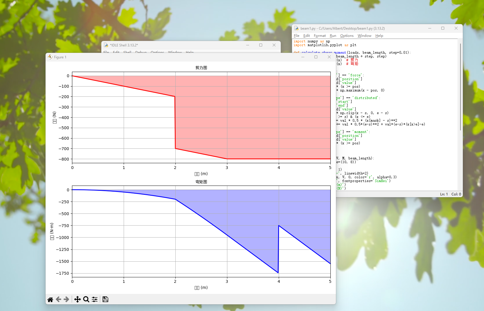
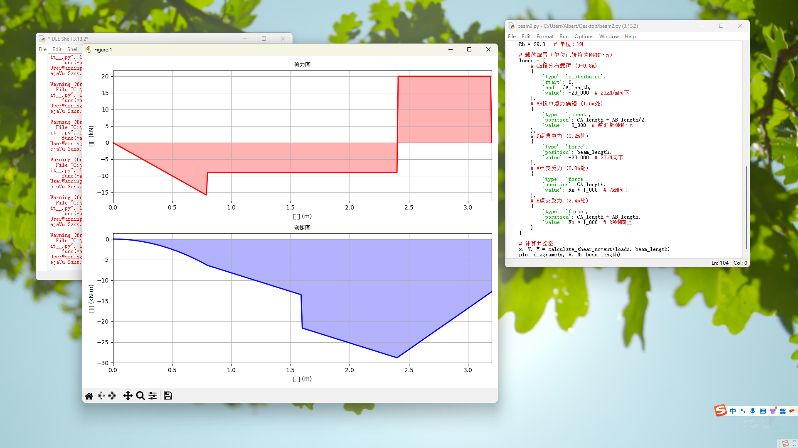
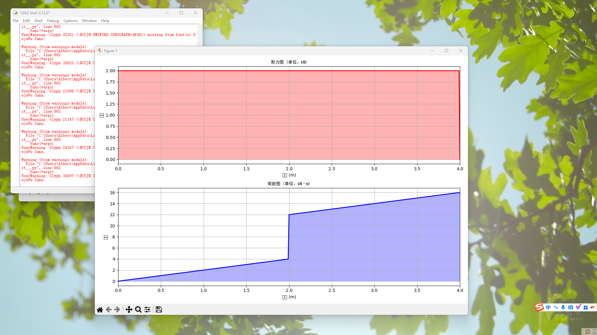

# AI-Assisted Structural Force Diagram Generation

## 🚀 Project Background

This project explores how AI-assisted workflows can automate structural force diagram generation in engineering mechanics.

The goal was to validate whether AI can help translate structured structural inputs into executable Python code and generate:

- Shear Force Diagram
- Bending Moment Diagram

This project was independently initiated and completed as a proof-of-concept experiment.

---

## 🧠 Core Idea

Transform structural problems into a structured workflow:

Manual Parameter Identification  
→ Structured Input  
→ AI Code Generation  
→ Python Execution  
→ Diagram Output  

This demonstrates the feasibility of workflow-based semi-automation.

------

## 🔎 Demo / Results

Workflow（流程示意）  

Shear Force Diagram and Bending Moment Diagram（剪力图和弯矩图）  

---

## ⚙️ Workflow Overview

1. Identify key structural parameters (supports, loads, span)
2. Convert parameters into structured format
3. Use AI to generate Python calculation script
4. Execute script to output shear and bending moment diagrams

---

## 📊 Supported Scenarios

- Simply supported beam with point load
- Uniformly distributed load
- Multiple load combinations

---

## 🛠 Tech Stack

- Python
- Matplotlib
- AI-assisted code generation

---

## 📈 Outcome

- Successfully validated AI-assisted engineering workflow
- Reduced manual calculation and plotting time significantly
- Demonstrated structured automation approach for structural analysis

---

## 📌 Key Takeaway

This project highlights the ability to:

- Break down complex engineering problems into structured workflows
- Design AI-assisted automation processes
- Validate technical feasibility through rapid prototyping
---
